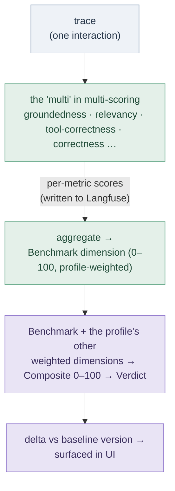
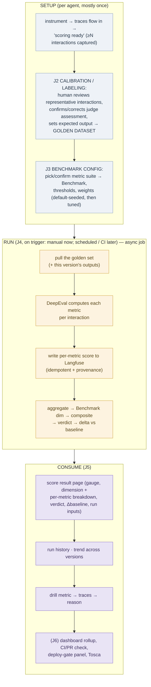
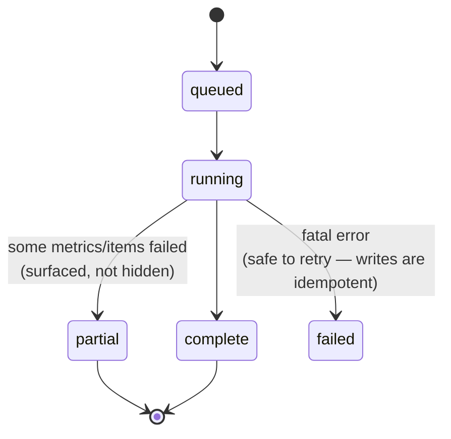

# Agent Score — Scoring: Flows & Journeys (pre-spec)

**Status:** Discovery / spec-basis (not yet an ADD) · **Date:** 2026-06-11 · **Informs:** the Phase B "Scoring engine" implementation spec

> **What this is.** A product-manager-oriented map of how Agent Score will turn an agent's **traces** into **quality scores** — the *flows and journeys*, end to end (setup → run → consume), covering UX/UI **and** backend process. It is the base for the implementation spec, not the spec itself. It assumes no prior evals expertise and builds the concepts up.
>
> **Two scoping decisions are baked in** (chosen 2026-06-11):
> 1. **Centered on the Benchmark dimension** — the LLM-as-judge "quality" slice, one of the profile's weighted dimensions that roll into the composite Value-Efficiency and UX-Signal were an earlier fixed-weight composite's other two slices; they are **retired, not on the roadmap** and appear below only as historical framing for how Benchmark rolled into that earlier headline number.
> 2. **Human labeling is in MVP** — we will build the calibration/labeling flow so reference-based metrics (judging against a known-good answer) work from day one. *This brings calibration forward from its current Phase-2 deferral; see §11.*
>
> **Companion doc:** the engine decision is settled in 
 — **DeepEval computes the metrics in our service; Langfuse stores the scores via `create_score()`.** This doc threads those constraints (idempotent writes, provenance snapshots) into the flows.
>
> Diagrams render natively on GitHub (Mermaid). If you're viewing this in a plain-text editor, open it in a Mermaid-aware viewer (GitHub, VS Code preview, `mermaid.live`) to see them rendered.

---

## 1. Your mental model, confirmed and refined

> *"This seems like a layer on top of the agent's traces that evaluates the quality of the agent based on the traces it receives — am I correct?"*

**Yes — with three refinements that shape everything below.**

1. **It is a read-only layer.** Scoring consumes the traces Langfuse already stores ([backend §2f](scoring-flows/backend-flows.md)); it never changes the agent or its traces. Output is *new* data (scores), written back to Langfuse and aggregated in our Postgres.
2. **It has three phases, not one.** (a) **Setup** — define *what* "good" means (which metrics; which labeled examples). (b) **Run** — on a trigger, score a *set* of interactions and aggregate. (c) **Consume** — surface scores, trends, deltas, verdicts.
3. **It judges a *set* against a *baseline*, not a single reply.** The product's claim is *"is this version good, and better than the last?"* — so a run scores a curated/representative **set** of interactions and compares the aggregate to a **baseline** version. This single fact drives the data model (§7) and the hardest decisions (§10).

**"Multi-scoring"** = several eval **metrics** computed per interaction (e.g. *groundedness*, *answer relevancy*, *tool correctness*, a custom *correctness* rubric), each producing a 0–1 score, aggregated into the **Benchmark dimension**, which then rolls up with the profile's other weighted dimensions into the **composite 0–100** ([ADD-030](00-design-decisions.md#add-030--dimension-weighted-composite)) and a **verdict** (Ship / Review / Block).

---

## 2. Eval concepts for a non-expert (the methodology)

This section is the "evals 101" you asked for. Skim the glossary, then read §2.2–§2.4 — they contain the two ideas most teams get wrong.

### 2.1 Glossary

| Term | What it means in Agent Score |
|---|---|
| **Trace / observation** | One agent interaction (a request and everything it did). A trace has observations (LLM generations, tool calls). Already ingested + stored in Langfuse; carries input, output, model, tokens, cost, latency, tags, version ([backend §2f](scoring-flows/backend-flows.md)). |
| **Interaction** | A trace treated as one unit-to-be-scored (input + the agent's output, plus any retrieved context / tools used). |
| **Metric** | One quality question, scored 0–1 (e.g. "is the answer grounded in the context it was given?"). The Benchmark dimension is **several** metrics. |
| **Score** | A metric's result for one interaction: a number + a natural-language **reason**. Stored as a Langfuse *score* on that trace. |
| **Judge model** | The LLM that reads the interaction and produces the metric score + reason ("LLM-as-judge"). Runs on **our** provider key. |
| **Reference-free metric** | Judges the output on its own — groundedness, relevancy, no-hallucination, tool-correctness. **No "correct answer" needed.** |
| **Reference-based metric** | Compares the output to a **known-good answer** (the "expected output"). Needs a human-labeled ground truth → requires calibration (§ J2). |
| **Golden / ground-truth example** | A curated interaction with a human-confirmed label (correct/incorrect and/or an expected output). The raw material reference-based metrics consume. |
| **Dataset** | The curated collection of goldens for an agent — the agent's "exam paper." |
| **Run** | One scoring execution: score a set of interactions with the metric suite, aggregate → composite + verdict. A long-running job (§ J4). |
| **Baseline** | The run a new run is compared against (per [§9](01-architecture.md): first completed run per agent; later, the last *approved* version). |
| **Delta** | How many composite points moved vs baseline, and which dimensions/metrics drove it. |
| **Verdict** | The composite mapped to a zone: Ship 85+ / Ship-with-note 70–84 / Review 55–69 / Block-recommended 40–54 / Block 0–39 ([PRODUCT.md](PRODUCT.md)). |
| **Threshold** | The pass/fail line for a metric or the composite (drives the verdict and CI gating). |

### 2.2 How an LLM-as-judge produces a score (and why provenance matters)

A metric sends the interaction to the judge model with a metric-specific prompt and gets back a **structured** result: a score (0–1) + a reason. Two mechanics worth knowing:

- **QAG (question-answer generation)** — how the strongest RAG metrics work: the judge breaks the output into atomic claims, verdicts each claim against the provided context, then *code* aggregates (e.g. groundedness = grounded-claims ÷ total-claims). Only the per-claim verdicts are LLM calls, so the score is more reproducible than a free-form 1–10 rating.
- **Custom criteria (G-Eval) and decision-trees (DAG)** — for our bespoke "correctness" rubric, the judge scores against plain-English criteria; a decision-tree variant trades flexibility for determinism. (Details in [05 §4](05-eval-engine-langfuse-vs-deepeval.md).)

**Provenance is not optional, and it's a methodology point, not just backend hygiene.** LLM judges drift: the same prompt on a newer model can score differently. The product's entire value is comparing version N to version N-1 — so **every score must carry the judge model id + the metric/prompt version that produced it** ([05 §8](05-eval-engine-langfuse-vs-deepeval.md)). Without that snapshot, a judge-model upgrade silently moves the baseline and every delta becomes untrustworthy. We store this on each Langfuse score and on the Run record.

### 2.3 The two kinds of run — **the single most important concept**

Version comparison is only valid when you control what changed. That forces two distinct run types with different data models and different UX:

| | **Golden-set run** (the product's spine) | **Live-sample run** (monitoring) |
|---|---|---|
| **Scores** | The agent's outputs for the **curated golden interactions** | A **fresh sample of recent production traces** |
| **Inputs across runs** | **Held fixed** (same goldens) | Different every run |
| **Answers** | *"Is version V good, and better than baseline?"* — a controlled **version delta** | *"Is quality drifting right now?"* — a **snapshot**, not a comparison |
| **Supports baseline/verdict?** | **Yes** — this is what a Ship/Block verdict rests on | No (inputs differ → delta is not apples-to-apples) |
| **Needs ground truth?** | Can use reference-based + reference-free metrics | Reference-free metrics only (no labels for fresh traces) |

> **The take-away for the spec:** the MVP must build the **golden-set run** first — it's the only run type that yields a defensible version verdict. Live-sample runs are a fast-follow for drift monitoring. Treat them as two run *modes*, not one.

### 2.4 The agent-score twist: we observe, we don't execute

A normal eval tool *re-runs the app* on the frozen golden inputs to get each version's fresh outputs, then scores them. **Agent Score does not execute the agent — it only observes traces** ([backend §2e](scoring-flows/backend-flows.md), pure pass-through forwarder). So "score version V on the golden inputs" requires V's **outputs for those inputs to arrive as traces**. There are three ways that can happen, and choosing among them is a core decision (§10):

1. **CI/CD re-execution (cleanest delta).** The customer's pipeline runs their agent against the fixed golden inputs on each deploy and the resulting traces flow in tagged with the new version. Same inputs, true version delta. (This is PRODUCT.md's "run on every deployment via CI/CD.")
2. **Production-trace matching.** We match incoming production traces back to golden inputs (by input similarity / id). No customer CI needed, but coverage is partial and matching is fuzzy.
3. **Aggregate-over-representative-sample.** Skip same-input matching; score a representative sample per version and compare *aggregates*. Easiest, but the delta is a population comparison, not a same-input one — a weaker guarantee that must be labeled as such in the UI.

**Critical: the three paths do not support the same metrics.** Reference-based metrics compare the actual output to a golden's **expected output**, so they need the scored output to *correspond to a golden input*. Paths differ:

| Path | Output corresponds to a golden? | Metrics it supports | Delta validity |
|---|---|---|---|
| 1. CI/CD re-execution | Yes (same frozen inputs) | reference-based **+** reference-free | strong (same-input) |
| 2. Trace matching | Fuzzy (matched) | reference-based (fuzzy) + reference-free | medium |
| 3. Aggregate sample | **No** (arbitrary recent traces) | **reference-free only** | weak (population) |

So "which traces a run scores" and "which metrics a run can run" are **the same decision**. Path 3 is effectively a live-sample run (§2.3) that happens to roll up a composite — it cannot run reference-based metrics and its delta is not same-input.

This is why §10's "what defines a version, and how do its golden outputs get produced?" is the pivotal product decision — not a detail. It selects the path, which selects the available metrics and the meaning of the delta.

---

## 3. Current state (what we have to build on)

Grounded in code; full maps in [`backend-flows.md`](scoring-flows/backend-flows.md) and [`frontend-flows.md`](scoring-flows/frontend-flows.md).

### 3.1 Agent setup — **built**
An Agent is provisioned via a DB-first saga (`provision_agent`, `packages/common/.../provisioning/agent.py:89`): DB row → Langfuse `projects.create` → `projectApiKeys.create` → `active`. Each Agent is **1:1 with a Langfuse Project** with its own `(pk_lf, sk_lf)` — this per-Agent boundary is the tenant-isolation primitive scoring writes must respect. Agents are operator-created (external-only) or minted by the write-once ingest path's content-based discovery ([ADD-068](00-design-decisions.md#add-068--write-once-trace-ingestion-buffer--assemble--fingerprint--write-once)).

### 3.2 Trace runtime — **built**
Spans arrive at the Ingest service on the external path (`POST /external/otel/v1/traces`, tenant-level `Bearer tk_`), buffer in Postgres, and a sweeper detects trace completion, decrypts `sk_lf`, and writes the assembled trace **once** to the resolved Agent's Langfuse Project (write-once path — [ADD-068](00-design-decisions.md#add-068--write-once-trace-ingestion-buffer--assemble--fingerprint--write-once)). (The internal endpoint `POST /internal/otel/v1/traces` is an unauthenticated no-op discard sink — [ADD-069](00-design-decisions.md#add-069--internal-ingestion-is-a-generic-discard-sink-aiws-reframed-identification-shape-deferred).) Langfuse buckets traces per Project natively. **Every field scoring needs is already captured and projected** (`langfuse_data/traces.py`): input, output, model, input/output/total tokens, `cost_usd`, latency, tags, environment, session, tool calls ([backend §2f](scoring-flows/backend-flows.md)).

### 3.3 Trace viewer — **built** (and a free head-start)
The back-office has a real trace list + detail viewer (`AgentTracesPage.tsx`, `AgentTraceDetailPage.tsx`) showing spans, I/O, model, tokens, cost, latency. **Notably: `TraceDetail.scores?: []` already exists in the API schema (`generated.ts:836`) but is never rendered** — the pipe for per-trace scores reaches the FE already; nothing fills or shows it yet.

### 3.4 The scoring layer — **greenfield, but the canvas is primed**
This is the unusual part: the *visual primitives* exist and are polished, but everything behind them is empty.

| Layer | State | Evidence |
|---|---|---|
| Score/verdict **primitives** | **REAL but orphaned** — `ScoreGauge` (used only by the dev gallery), `VerdictBadge` (used only by the mock dashboard) | `score-gauge.tsx`, `verdict-badge.tsx` |
| Scoring **screens** | **STUB** — `AgentScoringPage` (empty states + disabled "Add benchmark"/"Run now"), Agent overview composite card (hand-rolled "Pending", hardcoded /50·/30·/20 — a retired layout, not built, see ADD-084; dead code slated for removal), dashboard (MockWatermark) | `AgentScoringPage.tsx:4`, `AgentOverviewPage.tsx:49`, `App.tsx:8` |
| Scoring **nav** | No top-level "Scoring"; only a per-agent sub-tab | `sidebar-nav.ts`, `agent-shell.tsx:81` |
| Scoring **API / data** | **ABSENT** — no run/benchmark/verdict/composite path in `openapi.json`; no `Run`/`Benchmark`/`Score` model in Postgres | `frontend §4 Tier C`, `backend §4b` |
| Judge **LLM config + deps** | **ABSENT** — no provider key/model in any config; only `langfuse` in the dep tree (no `deepeval`/`anthropic`/`openai`) | `backend §5` |

**Implication:** we are not retrofitting a feature into a crowded surface — we're filling a clean, pre-shaped slot. The design intent is already sketched in the stubs (composite = N profile-weighted dimensions per [ADD-030](00-design-decisions.md#add-030--dimension-weighted-composite); verdict taxonomy ship/review/block; run record fields incl. Δbaseline + trigger). The build is: add the data layer + backend engine + judge config, then wire the existing primitives into real screens.

---

## 4. The target, end to end

DeepEval sits in the RUN box (compute); Langfuse stays the store throughout (traces in, scores out), consistent with [05](05-eval-engine-langfuse-vs-deepeval.md).

---

## 5. Journeys (per persona — UX/UI + backend)

Personas (MVP is a Tricentis-staff back-office; customer-facing is later): **Operator/CSM** (runs calibration with the customer, configures benchmarks), **QA/Release Manager** (consumes scores, approves/blocks), **Agent Engineer** (reacts to scores via CI later). Each journey below gives the **user steps**, the **UX/UI** surface, and the **backend process**.

### J1 — Onboarding & first traces → "scoring ready"  *(extends built flows)*
- **User steps:** create the agent (exists) → instrument → traces arrive (exists) → system signals when enough interactions are captured to calibrate (PRODUCT.md target: ≥20).
- **UX/UI:** on the Agent **Overview**, replace the hardcoded "Traces (24h)" area with a **scoring-readiness** indicator ("18 / 20 interactions captured — calibration unlocks at 20"). Reuses the live trace count already wired (`AgentOverviewPage.tsx`).
- **Backend:** a count query over the agent's traces (read path exists). A small `scoring_readiness` computed field; no new ingestion.

### J2 — Calibration / labeling  *(NEW — the human-ground-truth flow)*
This is the flow the "include human labeling now" decision adds. It produces the golden dataset that reference-based metrics and version deltas depend on.
- **User steps (Operator + customer, screen-share):** the system surfaces a **representative sample** of real interactions with the judge's *initial* assessment (correct/incorrect + reason). For each, the human **confirms or corrects** it, and where relevant **writes/edits the expected output** and notes *why*. Confirmed items become goldens.
- **UX/UI:** a **labeling queue** screen — one interaction at a time: input, the agent's output, the judge's proposed verdict + reason, and controls to Confirm / Override (with corrected verdict + expected output + note). Progress ("12 / 20 labeled"). **Build-vs-buy:** Langfuse's **annotation queues + datasets are OSS-free** ([05 §2](05-eval-engine-langfuse-vs-deepeval.md)) and are the natural substrate — we likely **embed/drive Langfuse annotation** rather than hand-build the labeling UI from scratch (decision in §10).
- **Backend:** select the representative sample (read path); optionally pre-score with the judge to seed proposals (DeepEval); persist labels as **dataset items / goldens** (Langfuse dataset or our table — §10) with provenance (labeler id, timestamp). Append-only.

### J3 — Benchmark configuration  *(NEW)*
- **User steps:** review the **default-seeded** metric suite for the agent, adjust which metrics are in, set thresholds and intra-Benchmark weights, confirm. (PRODUCT.md: "pre-populated… not a blank form.")
- **UX/UI:** wire the stubbed **Scoring tab** (`AgentScoringPage.tsx`) — a **Benchmarks** card listing the metric suite (metric name → sub-dimension, threshold, weight, reference-free vs reference-based badge), each editable; enable the currently-disabled "Add benchmark". Use existing `Card`/`FormSection`/`DataTable` patterns.
- **Backend:** `Benchmark` / `MetricConfig` CRUD per agent; default suite seeded on agent create (statically per [§9](01-architecture.md)); the config is **versioned** (its version rides on every score for provenance, §2.2).

### J4 — Scoring run  *(NEW — the engine; a long-running async job)*
- **User steps:** click **Run now** (MVP), pick scope (which version / golden set); later: scheduled or CI-triggered. Watch progress; open the result.
- **The run is a JOB, not a request** — N interactions × M metrics × judge LLM calls = minutes, real token cost, possible partial failures. It must have explicit states and be resumable:

- **UX/UI:** "Run now" → a **run progress indicator** (state, "scored 14/20 interactions", live/estimated **token cost**), then the result page (J5). Run history table per agent (run id, version, score, verdict, Δbaseline, trigger, cost, timestamp — the fields the mock dashboard already anticipates, `App.tsx:69`).
- **Backend (threads [05](05-eval-engine-langfuse-vs-deepeval.md)'s contract):** an **in-process module taking a `run_id`** (no new service, per [§3.6](01-architecture.md)); pull the golden set + this version's outputs from the trace read path; **DeepEval computes each metric in our service**; **write one Langfuse score per metric per interaction via `create_score()` on the per-Agent creds, idempotent on a stable `score_id`**, with judge-model-id + metric-version in metadata; **aggregate** → Benchmark dimension → composite → verdict → Δbaseline in our Postgres. Idempotency is load-bearing: a retried/resumed run must **upsert, never double-write** (ack after the row commits). Cost is captured per metric (DeepEval exposes it) and summed onto the Run.

### J5 — Results & monitoring  *(NEW — wire the orphaned primitives)*
- **User steps:** read the composite + verdict; see which dimensions/metrics drove it; compare to baseline; drill into a weak metric to the actual interactions and the judge's reason; track the trend across versions; approve a run as the new baseline.
- **UX/UI:**
  - **Score result page** — finally use the real `ScoreGauge` (composite) + `VerdictBadge`; a dimension breakdown (the profile's weighted dimensions, e.g. Benchmark) and, under Benchmark, the **per-metric scores**; a **Δbaseline** strip; "run inputs" (which goldens, which version, judge model, config version — provenance visible).
  - **Drill-through** — click a low metric → the list of interactions that scored low → open in the **existing trace viewer**, now rendering the Langfuse `scores` array (`generated.ts:836`, currently unrendered) with the judge's reason.
  - **Overview card** — replace the hand-rolled "Pending" circle with the live composite gauge + verdict.
  - **Trend** — score trajectory across versions (run history → line chart; recharts is already a dep).
- **Backend:** run-detail + run-history + per-trace-score read endpoints (new `/admin/.../scoring/*` routes); baseline-set on approval.

### J6 — External consumption  *(context; mostly post-MVP)*
Dashboard rollup across agents (the `HomePage` mock shows the target: attention list, verdict distribution, recent runs), CI/PR check (pass/fail on threshold), a deploy-gate panel, Tosca `AgentScoreCheck`. All read the same Run/score data; they are surfaces, not new scoring logic.

---

## 6. Conceptual data & state model

Entities and where they live (column schema is TBD in the Phase B ADD; this is the shape).

| Entity | Lives in | Purpose / key fields |
|---|---|---|
| **AgentVersion** | our Postgres | Identifies "which version" for baseline/delta. Source TBD (§10): trace `release`/`version` tag, deploy event, or manual mark. |
| **Golden (ground truth)** | Langfuse dataset *or* our table (§10) | **Frozen, version-independent:** input + expected output (optional) + confirmed label + labeler provenance. The "answer key." Versioned, but does not change per agent version. |
| **Version output (scored)** | from that version's traces | **Version-specific:** the agent's **actual output** for a golden input, produced via a §2.4 path (CI re-exec / trace-match / sample). *This* is what a Run scores — paired with a Golden for reference-based metrics, or scored standalone for reference-free. Distinct from the Golden. |
| **Benchmark / MetricConfig** | our Postgres | The per-agent metric suite: metric → sub-dimension, threshold, weight, reference-free/based, **config version**. |
| **Run** | our Postgres | One scoring execution. `run_id`, agent_version, dataset_version, benchmark_version, **`mode`** (golden-ci / golden-match / aggregate-sample — §2.4), **state** (queued/running/partial/complete/failed), trigger, judge_model_id, cost, created_at/by. |
| **Score (per metric per interaction)** | **Langfuse** (via `create_score`) | value + reason + dataType, idempotent `score_id`, provenance (model id, metric version, run id) in metadata. |
| **DimensionScore / Composite** | our Postgres | Aggregates per Run: per-dimension sub-scores (profile-defined, [ADD-030](00-design-decisions.md#add-030--dimension-weighted-composite)), composite 0–100. |
| **Baseline** | our Postgres | The Run a new run is compared against (first completed; later, last approved). |
| **Verdict** | our Postgres (derived) | Composite → zone. **Score→verdict banding lives on the backend** (FE never derives it — `frontend §4 Tier C`). |

Relationship spine: `Agent ─< AgentVersion ─< Run >─ Benchmark(version) ; Run >─ Dataset(version) ; Run ─< Score(per metric per interaction, in Langfuse) ; Run → Composite → Verdict → Δ Baseline`.

> **Baselines compare within a mode.** A composite from an `aggregate-sample` run is **not** comparable to a baseline from a `golden-ci` run — different inputs, different metric set (reference-free only vs full suite). The Run carries its `mode`, and delta logic must **refuse cross-mode comparison** (or label it "approximate, not a controlled delta"). This is what keeps a Ship/Block verdict honest.

---

## 7. UX/UI surface inventory (what to build, and the starting point)

| Surface | Journey | Start from | Build |
|---|---|---|---|
| Scoring-readiness indicator | J1 | live trace count (REAL) | small computed field + badge |
| **Labeling queue** | J2 | — (new) | embed/drive **Langfuse annotation** (§10) or new screen |
| **Benchmark config** (Scoring tab) | J3 | `AgentScoringPage.tsx` STUB | wire Benchmarks card; enable "Add benchmark" |
| **Run now + progress** | J4 | disabled button STUB | trigger + async run-state indicator + cost |
| **Score result page** | J5 | `ScoreGauge`/`VerdictBadge` REAL but orphaned | new page wiring the primitives + breakdown + Δ |
| Overview composite card | J5 | `AgentOverviewPage.tsx` STUB ("Pending") | swap in live gauge + verdict |
| Trace-detail **scores** render | J5 | `scores` field present, **unrendered** | render Langfuse scores + judge reason |
| Run history table | J4/J5 | mock fields in `App.tsx` | real table |
| Trend chart | J5 | recharts dep present | versions × composite |
| Dashboard rollup | J6 | `HomePage` MockWatermark | replace mock with real |
| (optional) top-level "Scoring" nav | — | none today | decision §10 |

Design system to reuse: `EntityShell`/`AgentShell`, `PageHeader`, `Toolbar`, `DataTable`, `EmptyState`, `StatCard`, `Card` 5/7 split, TanStack Query array keys; new API wrapper `agents/scoring-api.ts` after `pnpm codegen` (`frontend §5`).

---

## 8. Backend process inventory (what to build)

| Piece | Journey | Notes (consistent with [05](05-eval-engine-langfuse-vs-deepeval.md)) |
|---|---|---|
| `Run` / `Benchmark` / `AgentVersion` / Dataset models + migration | J3/J4 | Postgres; schema = Phase B ADD |
| Default metric-suite seeding on agent create | J3 | static per [§9](01-architecture.md) |
| Benchmark/MetricConfig CRUD routes | J3 | versioned config |
| Labeling: sample-select + persist goldens | J2 | reuse trace read path; Langfuse dataset/annotation |
| **Scoring engine module** (`run_id` → pull → DeepEval → `create_score` → aggregate → verdict → baseline) | J4 | in-process; idempotent `score_id`; provenance snapshot; async/job semantics + states |
| Run trigger + run-state + run-history + score-read routes | J4/J5 | new `/admin/.../scoring/*` |
| Judge **LLM config** (`secret_field` provider key + model id) + **deps** (`deepeval` + LLM client) | J4 | net-new; `DEEPEVAL_TELEMETRY_OPT_OUT=1` ([05 §8](05-eval-engine-langfuse-vs-deepeval.md)) |
| Tenant-isolation tests for every new scored-data route | all | CI-asserted (CLAUDE.md) |

---

## 9. Key product decisions to make (with recommendations)

These are the choices the spec must close. Recommendations are starting points, not commitments.

1. **What defines an "agent version," and how do its golden outputs get produced? (§2.4 — the pivot.)** *Rec:* use the trace `release`/`version` tag as the version key; primary delta path = **CI/CD re-execution** of the golden inputs on deploy; allow **aggregate-sample** comparison (labeled "approximate") when no CI exists. This single decision shapes the Run model and the whole delta story.
2. **Golden-set run first; live-sample run later.** *Rec:* MVP builds only the golden-set run (the verdict-bearing one, §2.3); defer live-sample/drift runs.
3. **Where do goldens live — Langfuse dataset vs our table?** *Rec:* Langfuse datasets (OSS-free, native dataset-run linkage) unless we need fields Langfuse can't hold; revisit if so.
4. **Labeling UI — embed Langfuse annotation vs build our own.** *Rec:* embed/drive Langfuse annotation queues for MVP (don't hand-build); thin wrapper for our confirm/override semantics.
5. **The metric suite & intra-Benchmark weights** (which DeepEval metrics → which sub-dimension). *Rec:* pin in the Phase B ADD — the mapping **is** the benchmark definition ([05 §8](05-eval-engine-langfuse-vs-deepeval.md)). Likely start: groundedness/faithfulness, answer relevancy, a G-Eval correctness rubric; add tool/task metrics for agentic agents.
6. **Reference-free vs reference-based per metric.** Labeling **is** in MVP (the chosen ground-truth approach), so reference-based metrics are a launch goal — this is purely about *sequencing within* that, not skipping labels. *Rec:* reference-free metrics (groundedness, relevancy) can run **while** an agent's labeling is still in progress, so an agent gets partial scores early; reference-based metrics activate once its labeled dataset exists.
7. **Threshold / verdict banding defaults.** *Rec:* seed PRODUCT.md's zones; keep banding backend-side (FE doesn't derive it).
8. **Judge model/provider + cost controls.** *Rec:* Anthropic or Azure (both first-class in DeepEval); cap run size; show per-run cost; respect the $225K token budget.
9. **Trigger model for MVP.** *Rec:* manual "Run now" only; scheduled + CI as fast-follow.
10. **Calibration cadence & ownership.** *Rec:* one-time per agent to start, re-calibrate on major version change; Operator+customer own it.
11. **Top-level "Scoring" nav?** *Rec:* keep per-agent for MVP; add a cross-agent dashboard (J6) when multi-agent rollups matter.

---

## 10. Phasing & divergences (flag explicitly)

- **Calibration brought forward.** [§9](01-architecture.md) currently defers the AI-assisted calibration session to Phase 2. The "human labeling in MVP" decision moves the **labeling/ground-truth** flow (J2) into MVP. Implication: more UX to build now, but reference-based metrics and defensible deltas are available at launch. The *full* AI-assisted calibration UX (rich session, value anchors) can still phase in; J2 is the minimal labeling needed for reference-based scoring. **This divergence is a deliberate PM decision — record it in the Phase B ADD.**
- **Value-Efficiency & UX dimensions — retired.** These were an earlier fixed-weight composite's other two slices; they are **retired, not on the roadmap** ([ADD-084](00-design-decisions.md)). The composite is the profile's dimension-weighted roll-up ([ADD-030](00-design-decisions.md#add-030--dimension-weighted-composite)) — the seeded default profile runs Benchmark-only today, and growing the composite means authoring more dimensions in the catalog, not reviving VE/UX.
- **Soft-delete vs Langfuse cleanup (minor, pre-existing).** [§7.4](01-architecture.md) says agent soft-delete triggers Langfuse cleanup; the code only cleans on **purge** (`agents.py:471`). Not a scoring issue, but scored-data lifecycle should assume traces+scores survive soft-delete until purge.
- **MVP vs fast-follow summary.** *MVP:* J1 readiness, J2 labeling (via Langfuse annotation), J3 benchmark config, J4 golden-set run (manual trigger), J5 results + drill + trend. *Fast-follow:* live-sample/drift runs, CI/scheduled triggers, dashboard rollup, deploy-gate/Tosca surfaces.

---

*Next step: turn this into the implementation spec (the `/spec` interview is a good vehicle), closing the §9 decisions first — decision #1 (version + golden-output production) gates the Run data model and should be settled before schema work begins.*
