# Agent Score — Scoring Engine Reference

**Status:** current-state technical reference, grounded in code · **Companions:** [06-agent-scoring-flows.md](06-agent-scoring-flows.md) (dated pre-spec discovery doc — flows/journeys, not implementation), 13-user-guide.md (user-facing surface), 00-design-decisions.md (ADD-030/031/089/091/122 are the load-bearing decisions this doc narrates), 01-architecture.md §3.8

> Agent Score never executes the agent it scores — it only reads traces the agent already sent (OTLP → Langfuse). A **Scoring Run** turns a set of traces into per-eval scores, rolls them into a **composite 0–100**, and maps that to a **ship/hold verdict** with a delta against a baseline. This doc walks the full pipeline as it is actually implemented today (`services/platform/src/agent_score_platform/scoring/`), not the target state.
>
> Diagrams render natively on GitHub (Mermaid). If you're viewing this in a plain-text editor, open it in a Mermaid-aware viewer (GitHub, VS Code preview, `mermaid.live`) to see them rendered.
>
> **In plain terms:** think of Agent Score as a copy-editor for your AI agent, not a participant in the conversation. It never talks to your agent directly — it only reads conversations your agent already had, grades each one against a checklist of quality questions, and boils that down to one 0–100 score with a plain "ship it / hold off" recommendation. Each section below opens with an **In plain terms** note before the technical detail, so you can skim those and still get the full picture.

---

## 1. End-to-end pipeline

> **In plain terms:** every conversation your agent has gets copied into a message store (the "trace store"). When someone clicks **Run**, we take a batch of those conversations, hand them out to a pool of workers who grade each one, and once every conversation in the batch has been graded, one worker tallies the results into a single score and verdict shown in the UI.

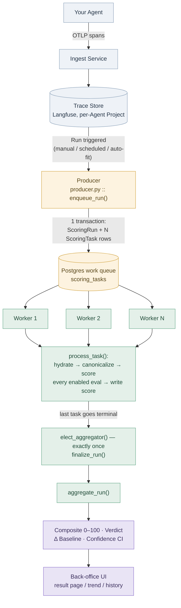

**The load-bearing property:** Agent Score is a read-only observer. "Scoring version V" only works if V's outputs for the golden inputs *arrive as traces* — there is no re-execution step anywhere in this system.

---

## 2. Configuration layer: how "what to score" is defined

> **In plain terms:** this is the grading rubric setup, done once per agent (and reusable across agents). An **eval** is one grading question ("did the agent stay grounded in the facts it was given?"). Related questions are grouped into a **dimension** — a grading category, like Correctness or Safety. A **profile** bundles a set of dimensions and their weights into one complete rubric. Each agent is pointed at exactly one rubric version — that pointer is the **benchmark**.

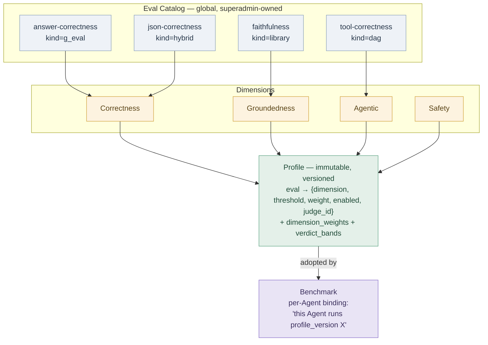

- **Eval** — one quality check, scored 0–1. `kind` decides *how* it computes (table in §4).
- **Dimension** — a quality axis (Correctness, Groundedness, Relevance, Retrieval, Agentic, Conversational, Quality, Safety). An eval belongs to exactly one weighted dimension *within a given profile* — no double-counting.
- **Profile** — the versioned bundle: eval selection + per-eval threshold/weight/judge override + dimension weights + verdict bands. Profiles are **immutable per version** — editing creates a new version; an agent stays pinned to its adopted version until it explicitly re-adopts (ADD-026).
- **Benchmark** — the per-agent pointer to one profile version. Every agent gets one **atomically at creation**, in the same transaction as the `Agent` row, so no agent is ever unscoreable (ADD-032).

This catalog is the **single** source of scoring config (ADD-031) — there is no separate per-agent metric-config table to drift against it.

---

## 3. The canonical trace: what an eval actually reads

> **In plain terms:** before grading, we tidy up the raw, messy conversation log into a clean, consistent summary — which tools were called, what the model said, how turns fit together. Every grading question reads that tidy summary, never the raw log, so they're all working from the same consistent picture.

Before any eval runs, the raw Langfuse trace is normalized into a **canonical projection** — computed fresh every time, never stored, so it can never drift from the source trace:

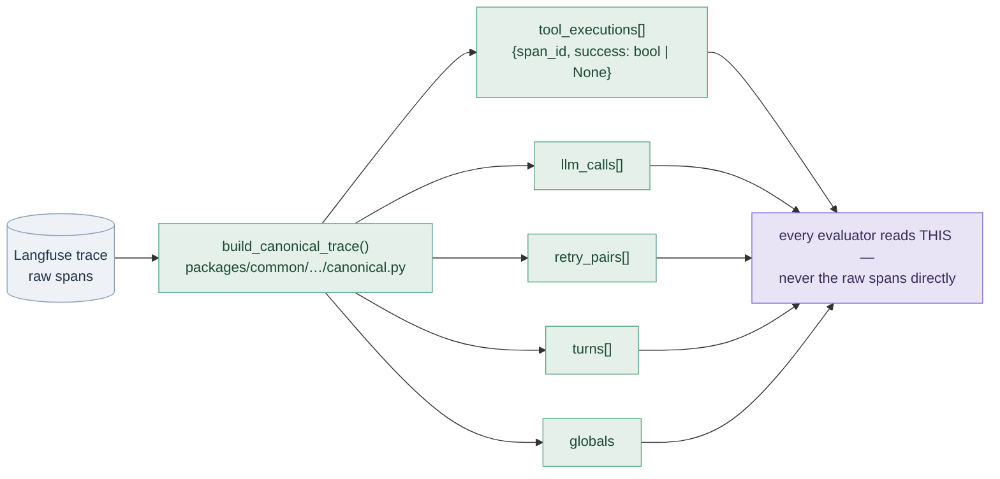

`success` on a tool call is derived conservatively from instrumentation/`level`/`status_message`: a `WARNING` is not a failure, and an undecidable case is `None` — never guessed as `True`/`False` (ADD-035).

---

## 4. Scoring one interaction: eval kinds

> **In plain terms:** not every grading question works the same way. Some use an off-the-shelf grading formula. Some ask another AI to grade against a plain-English description of "good." Some walk a fixed yes/no flowchart. And some split the work — an AI pulls out the individual factual claims, then ordinary code (no AI, no variance) tallies them into a score.

| Kind | Mechanism | In plain terms | Deterministic? |
|---|---|---|---|
| **Library** | A pre-built DeepEval metric (Faithfulness, Hallucination, Answer Correctness, …) | An off-the-shelf grading formula we didn't have to invent | Per-metric |
| **G-Eval** | Plain-English criteria scored by an LLM judge | We describe what "good" looks like in plain English and have another AI grade against that description | No (judge variance) |
| **DAG** | A decision tree of yes/no judge nodes → fixed leaf scores | A flowchart of yes/no questions that always lands on the same score for the same answers | Yes |
| **Hybrid** | LLM extracts structured evidence claims (**MAP**) → pure code reduces them to a score (**REDUCE**) | An AI pulls out the individual factual claims; then plain code (no AI) tallies them into a score | REDUCE step is deterministic |

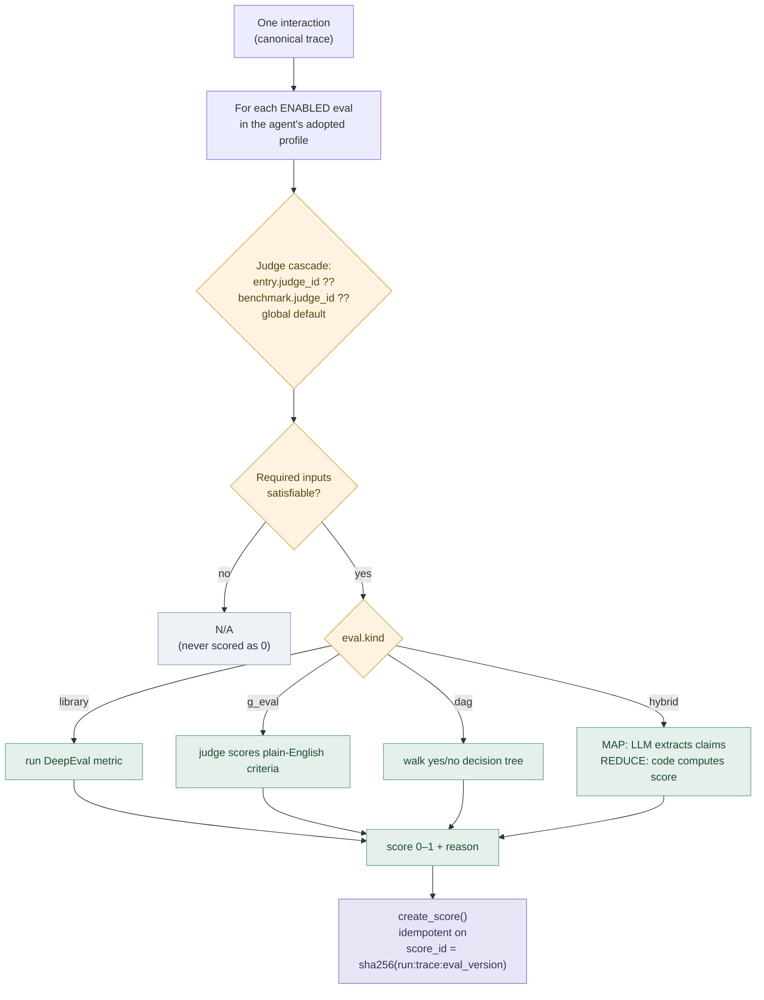

The "judge cascade" in the diagram above just means: use this eval's own judge model if one is set, otherwise fall back to the agent's default judge, otherwise the system-wide default.

Missing required inputs (e.g. a faithfulness eval with no retrieved context in the trace) produce **N/A**, never a zero — the composite must only reflect what was actually measured.

---

## 5. Goldens and calibration

> **In plain terms:** some grading questions need an answer key — e.g. "was this objectively the correct answer?" Since there's no pre-existing answer key, a human reviews a sample of real conversations, confirms or corrects the AI's initial guess, and that confirmed set becomes the answer key (the **golden dataset**) other checks can compare against.

Reference-free evals (faithfulness, tool-correctness, safety) score immediately, from day one. Reference-based evals (answer-correctness, JSON conformance) need a human-confirmed expected answer:

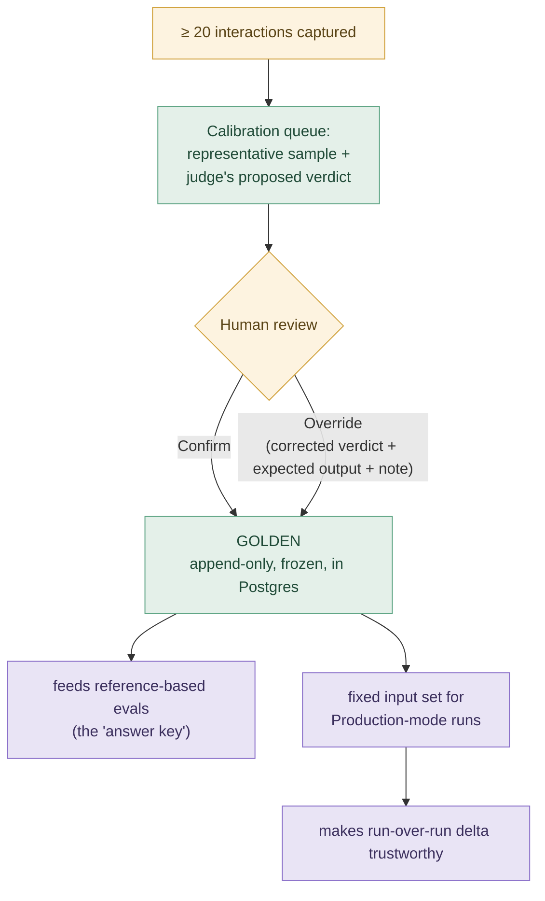

Without goldens, only reference-free evals run. Goldens unlock reference-based evals *and* enable Production-mode runs, whose fixed input set is what makes version deltas meaningful (§8).

---

## 6. Run dispatch: the Postgres queue + worker pool

A run is never an in-process function call — it is dispatched through a **Postgres-backed work queue with an independently-scaled worker service** (ADD-091). This is the *sole* dispatch path — an earlier in-process executor was deleted, not kept as a fallback.

> **In plain terms:** a run doesn't happen in one single process. Instead, we drop a to-do list of grading tasks into a shared queue in the database. Any number of worker processes can pick up tasks from that queue — like a deli counter's ticket system, no two workers ever grab the same ticket — grade them, and mark them done. Once every ticket for a run is done, one worker (picked automatically) tallies the final score. If a worker crashes mid-task, its claimed tickets time out and get picked up again by another worker, checked by a background "reaper."

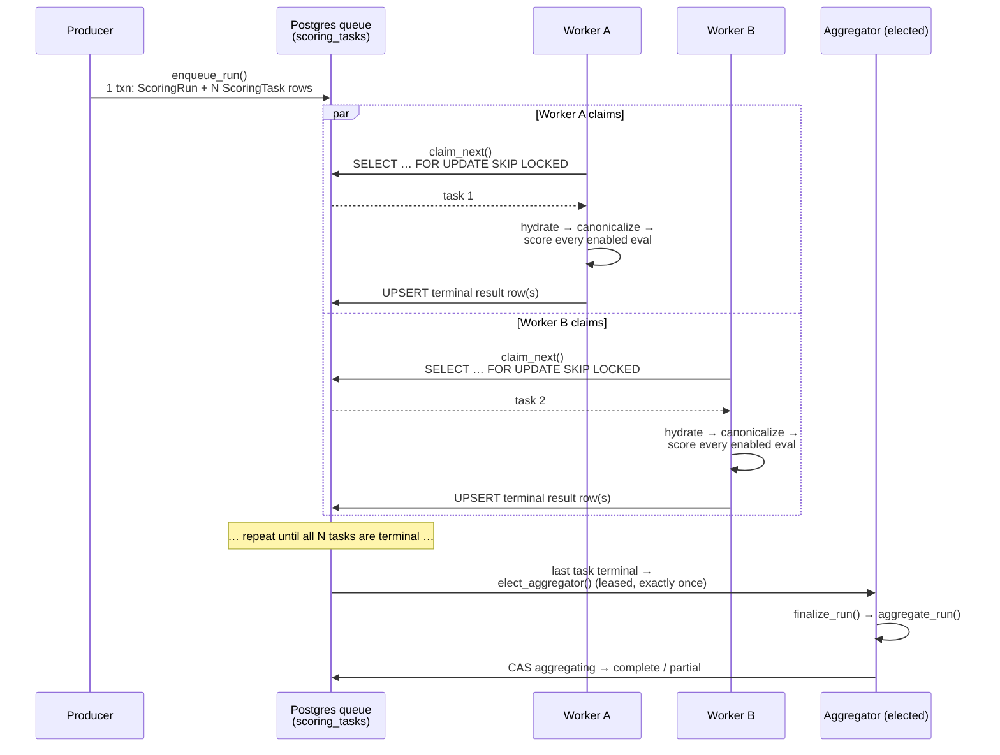

Correctness guarantees that make this safe under retry/partial-failure:
- **Every task reaches a terminal state**; a run finalizes exactly once.
- **`total_tasks` is the actual post-dedup row count**, never the pre-dedup sample size — a dropped duplicate can never leave the fan-in permanently waiting.
- **Terminal `(task_id, eval_slug)` results are UPSERTed**, never double-inserted — a lease-reclaim retry overwrites in place. (In plain terms: if a worker's claim on a task expires and another worker redoes it, the second result just overwrites the first in place — it never creates a duplicate.)
- **`score_id = sha256(run_id:trace_id:eval_version_id)`** makes every Langfuse score write idempotent — safe to resume a failed run without double-counting. (In plain terms: each score gets a fingerprint derived from what produced it, so writing the same score twice — say, after a retry — never counts it twice.)
- A reaper loop (advisory-locked) requeues expired leases so a crashed worker's tasks aren't stranded. (In plain terms: a background check that notices when a worker has gone silent and hands its unfinished tasks to someone else.)

### Run lifecycle states

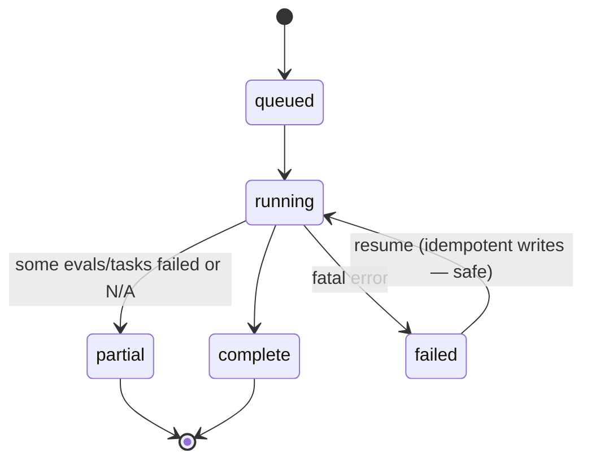

---

## 7. Aggregation: the exact composite math

> **In plain terms:** each grading question's scores get averaged — but only if enough conversations actually got scored on it; otherwise that question is skipped entirely, not counted as a zero. Those averages combine into a category score using each question's weight, and the categories combine the same way into the final 0–100. At every step, if something doesn't have enough data, it's dropped from the average rather than dragging the score down.

`aggregate.py` is a **pure function, no I/O** — the same math runs whether it's called from the queue's `finalize_run` fan-in or the ephemeral Runner-preview path. Two stages, both renormalized (in plain terms: at each step, weights are rebalanced over only the questions/categories that actually had enough data, so nothing gets diluted by data that isn't there):

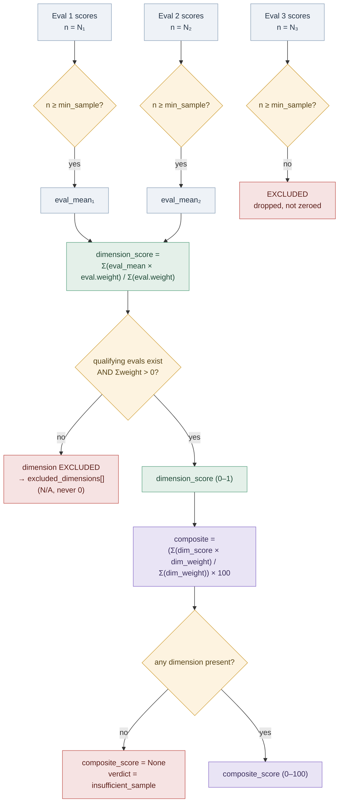

Key invariants (all enforced in `aggregate_run`, `services/platform/src/agent_score_platform/scoring/aggregate.py:105`):

- The **eval-grain `min_sample` is the only sample floor** — there is no separate per-dimension floor. (`min_sample` = the minimum number of graded conversations a question needs before its average counts at all.)
- **Exclude, never zero.** An eval or dimension that doesn't qualify is omitted from its parent's renormalization, not silently scored as 0 — this stops one starved metric from either dragging down or artificially propping up its dimension.
- **Weights need not sum to 1.** They're always renormalized over whatever actually qualified for that run.
- A **single-dimension profile is valid** — its composite is just that dimension's score.

### Verdict bands

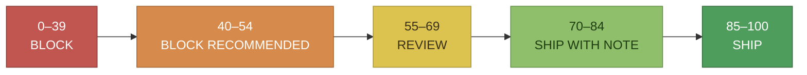

| Composite | Verdict | Meaning |
|---|---|---|
| 85–100 | **Ship** | Deploy with confidence |
| 70–84 | **Ship with note** | Deploy, document the trade-off |
| 55–69 | **Review** | QA/PM review before deploying |
| 40–54 | **Block recommended** | Strong signal to hold |
| 0–39 | **Block** | Do not ship |
| — | **Insufficient sample** | No present dimension / not enough scored interactions |

Bands + dimension weights are **frozen in the run's snapshot** at score time — a later profile edit can never retroactively re-score a completed run (`verdict_for`, `aggregate.py:334`).

### 3-state ship decision (what the UI actually gates on)

The 6-state verdict above is collapsed server-side (`_ship_decision`, `aggregate.py:294`) into a human-facing 3-state field — the frontend never re-derives banding:

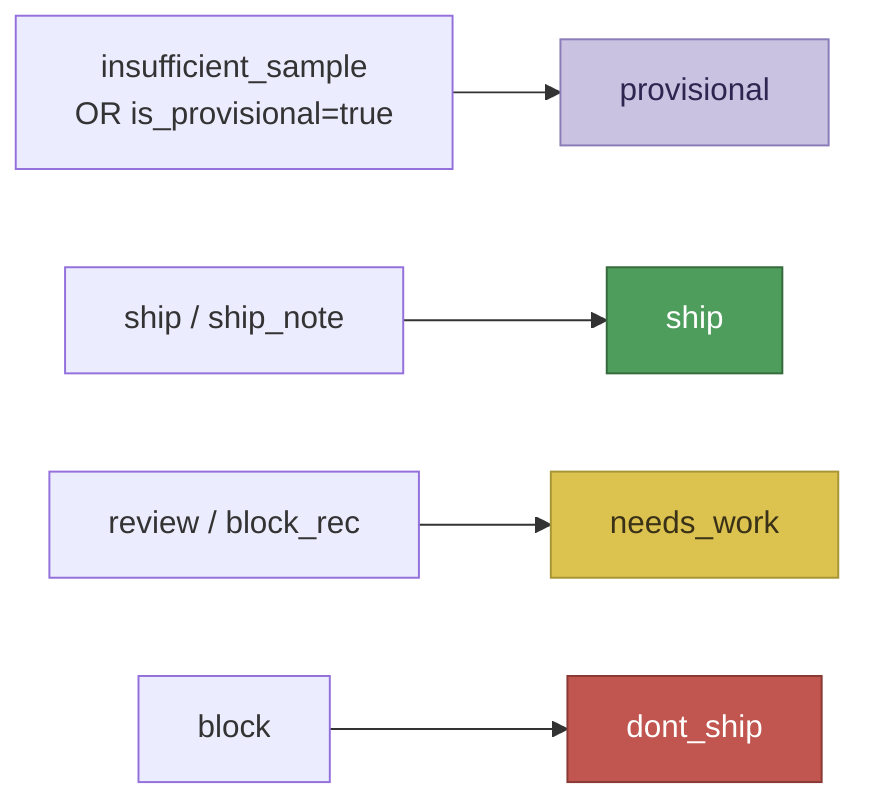

### Provisional guards (three independent OR-branches)

A run can carry a clean composite yet still be forced `provisional`, for any of:

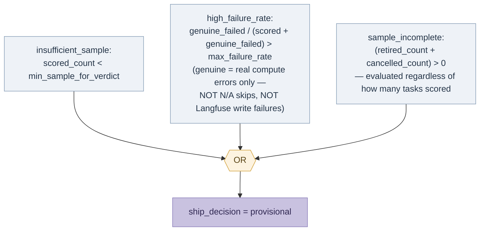

The `sample_incomplete` branch fires regardless of how many tasks *did* score — a run that scored 30/50 and silently lost 20 to retirement is not "low sample" by the min-sample floor, and would otherwise publish a clean verdict over a truncated sample.

### Confidence interval

Each composite carries a 95% CI (e.g. `74 ± 4`), computed via a conservative Bernoulli variance bound (`p(1-p)` per interaction) propagated through both the per-dimension and composite weighting stages. More scored interactions → narrower CI.

> **In plain terms:** this is a margin of error, like a political poll's "±3 points." A score of `74 ± 4` means the true score is probably somewhere between 70 and 78, not exactly 74. The fewer conversations that got scored, the wider that margin — score more conversations and the range narrows.

---

## 8. Delta vs baseline

> **In plain terms:** we only compare like-for-like. If the new run's setup differs from the baseline in some way that could confound the comparison — different questions, different answer key, a big swing in how many conversations got scored — we still show the point difference, but label it "approximate" rather than pretend it's a clean apples-to-apples number. We refuse to show a comparison at all only when the two runs used fundamentally different modes (e.g. comparing live production traffic to a sandbox test).

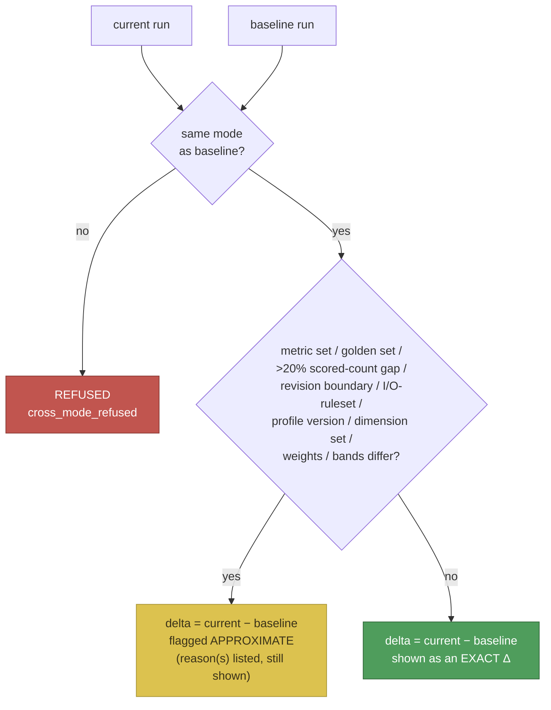

A delta is **refused outright** only across modes (Production vs Sandbox — different inputs, not apples-to-apples). Everything else that could confound the comparison **still shows a number**, just labeled `approximate` with the specific reason(s) — never silently presented as precise when it isn't (`compute_delta`, `aggregate.py:385`).

---

## 9. Provenance: why none of this can drift silently

Every score and every run snapshot carries:

- **Judge model id + metric/prompt version** that produced it — an LLM-judge upgrade would otherwise silently move every future score without changing anything about the agent.
- **Profile version id, dimension weights, verdict bands** — frozen at run time, so a later catalog edit can't retroactively change a historical verdict.
- **I/O-resolution ruleset version** — a fixed extraction bug must show up as `approximate`, not as a silent quality jump.

This is the throughline of the whole design: **a Ship/Block verdict must never be a confident-looking wrong answer.** Every mechanism above — exclude-not-zero, idempotent writes, the three independent provisional branches, refuse-or-flag deltas, and frozen provenance snapshots — exists to make a misleading composite structurally hard to produce by accident.

---

## 10. Key source files

| Concern | File |
|---|---|
| Aggregation math (pure, no I/O) | `services/platform/src/agent_score_platform/scoring/aggregate.py` |
| Run dispatch entry points | `services/platform/src/agent_score_platform/scoring/runner.py` |
| Postgres work queue engine + fan-in | `services/platform/src/agent_score_platform/scoring/queue.py` |
| Per-task worker body + claim loop | `services/platform/src/agent_score_platform/scoring/worker.py` |
| Run enqueue | `services/platform/src/agent_score_platform/scoring/producer.py` |
| Canonical trace projection | `packages/common/src/agent_score_common/trace_store/canonical.py` |
| Judge resolution + shared helpers | `services/platform/src/agent_score_platform/scoring/judge.py` |
| Ephemeral multi-trace preview (Runner) | `services/platform/src/agent_score_platform/scoring/runner_preview.py` |

Relevant design decisions: ADD-019 (DeepEval as the pinned engine), ADD-030 (composite math), ADD-031 (catalog as config source), ADD-035 (canonical trace), ADD-036 (hybrid kind), ADD-060/ADD-089 (confidence + provisional guards), ADD-091 (queue/worker architecture), ADD-122 (retired/cancelled-task provisional guard).
